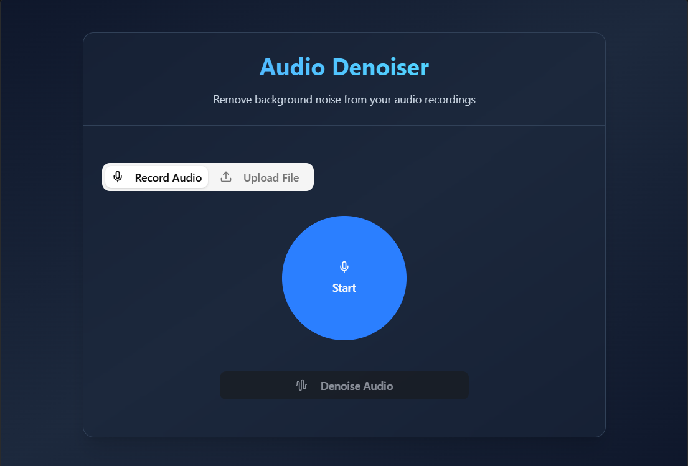

# Audio Denoiser (DCUNet)

A web app that removes background noise from speech recordings using a pretrained DCUNet model. The backend is a Flask API that runs the denoising model, and the frontend is a Vite + React UI.



## Project structure

- backend/ - Flask API, model code, metrics, and runtime folders
- frontend/ - React UI (Vite)
- notebooks/ - training and exploration notebooks
- docs/ - screenshots and documentation assets
- environment.yml - conda environment for the backend

## Prerequisites

- Conda (Miniconda/Anaconda)
- Node.js 18+ and npm
- ffmpeg installed and available on PATH

## Setup and run (local)

### 1) Backend

```powershell
cd "C:\Users\HP\Desktop\Audio denoiser\Audio-denoising-using-deep-learning"
conda env create -f environment.yml
conda activate audio_denoiser1
python backend\server.py
```

The API runs on http://localhost:5000 and exposes POST /denoise.

### 2) Frontend

```powershell
cd "C:\Users\HP\Desktop\Audio denoiser\Audio-denoising-using-deep-learning\frontend"
npm install
npm run dev
```

Open the URL shown by Vite (usually http://localhost:5173).

## Model weights

The backend expects pretrained weights at:

```
backend/Pretrained_Weights/Noise2Noise/mixed.pth
```

These weights are intentionally ignored by git. Place them manually before running.

## Runtime outputs

The backend writes temporary files to:

```
backend/Samples/
```

This folder is ignored by git.

## Notes

- If you see file-lock issues on Windows when renaming folders, close any terminals or processes using that folder and retry.
- For best results, record or upload WAV/WebM audio with clear speech and minimal clipping.
